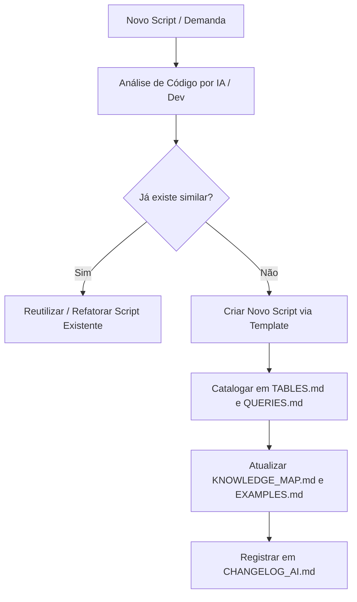

# GOVERNANCE.md — Governança da Base de Conhecimento e Integridade

Este documento estabelece as diretrizes de qualidade, rastreabilidade, prevenção de alucinações e manutenção permanente do repositório.

---

## 🛡️ 1. Princípios de Governança

1. **Permanência e Crescimento**: O repositório foi construído para durar anos. Todas as contribuições devem focar na legibilidade, sustentabilidade e modularidade.
2. **Rastreabilidade**: Todo exemplo e documentação deve apontar diretamente para o arquivo `.p` ou `.i` correspondente usando links de arquivo (`file:///...`).
3. **Classificação Rigorosa**: Scripts devem ser categorizados pelas suas finalidades primárias e secundárias (ex: `consultas`, `auditoria`, `segurança`).

---

## 🔍 2. Protocolo de Inferência (Não-Alucinação)

Para manter o repositório como fonte técnica 100% confiável:

- **Informação Confirmada**: Dados extraídos explicitamente do código (ex: campos utilizados no `EXPORT` ou `WHERE`, tabelas no `FOR EACH`).
- **Informação Inferida**: Índices de tabelas, chaves primárias ou regras de negócio implícitas que não estejam declarados explicitamente no script devem obrigatoriamente conter a marcação:
  > **`(Inferência)`**

Exemplo:
```markdown
### Tabela usuar_mestre
- **Índice Principal**: `cod_usuario` (Inferência — deduzido pelo uso no WHERE de igualdade)
```

---

## 🔄 3. Ciclo de Vida do Conhecimento


