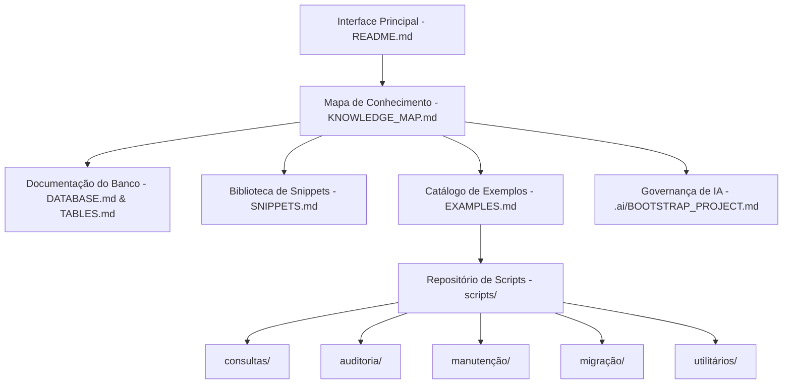

# ARCHITECTURE.md — Arquitetura da Base de Conhecimento

Este documento detalha os princípios arquiteturais, a estrutura em camadas e os critérios de organização desta Base de Conhecimento Progress OpenEdge / TOTVS Datasul.

---

## 🏛️ 1. Visão Geral da Arquitetura

A Base de Conhecimento foi concebida sob uma arquitetura **desacoplada e orientada à reutilização**, onde o repositório é tratado não como uma aplicação final, mas como um **ecossistema de inteligência técnica**.

---

## 📐 2. Princípios Arquiteturais

1. **Separação entre Código e Documentação**: Os scripts ABL/4GL ficam em `scripts/` e `consultas/`, enquanto as análises relacionais e de negócios ficam em `docs/`.
2. **Catalogação Indexada**: Toda tabela e script é catalogado de forma única, mantendo referências cruzadas navegáveis.
3. **Extensibilidade Multi-Ano**: A estrutura de diretórios acomoda novos domínios do Datasul (Manufatura, Faturamento, WMS, Contabilidade, etc.) sem reorganizações destrutivas.
4. **Governança de IA Nativa**: A pasta `.ai/` fornece todo o arcabouço para que qualquer LLM/Agente interaja com o projeto preservando o histórico e sem inventar dados.
